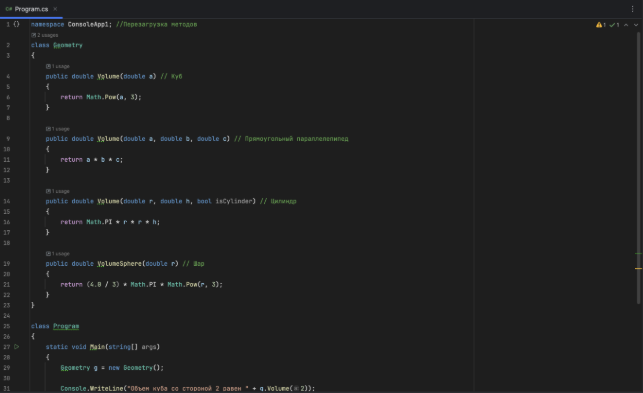
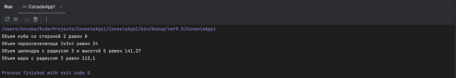
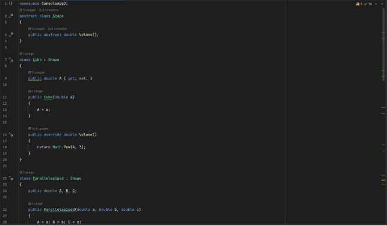
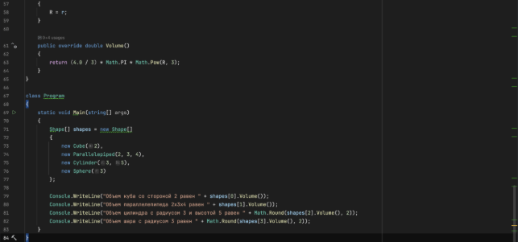
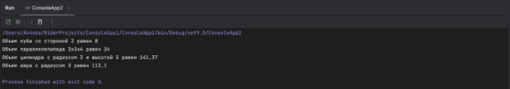
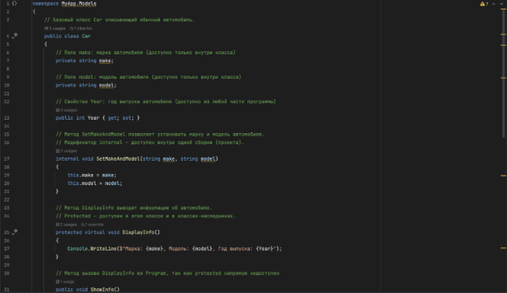
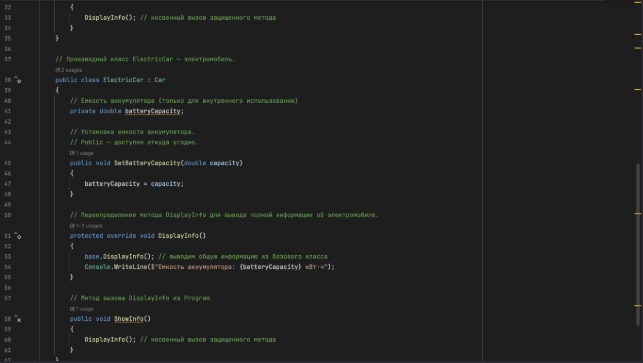
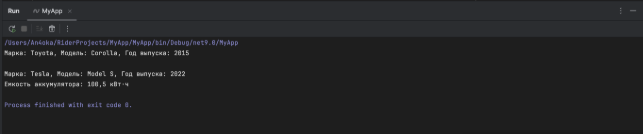
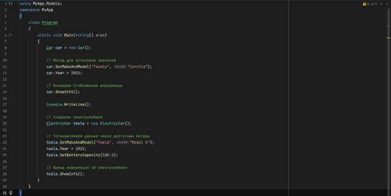


**Практическая работа «Перегрузка методов и полиморфизм»**

**Задание:** Расчет объема куба {V=a3}, прямоугольного параллелепипеда {V=a\*b\*c}, цилиндра {V=π\*r2\*h}, шара {(V=4\*π\*r3)/3}.

Порядок выполнения работы:

Создайте 2 проекта. В одном используйте перезагрузку методов, а в другом –полиморфизм.

В результате должны выводиться сообщения типа:

«Объем куба со стороной 2 равен 8.»

«Площадь поверхности цилиндра с радиусом 3 и высотой 5 равен 150,72.»

Перезагрузка методов

Полиморфизм

**Практическая работа «Модификаторы доступа в C#»**

**Задание:**

Создайте новый проект в Visual Studio или другой IDE, поддерживающей C#.

Создайте класс Car в пространстве имен MyApp.Models с следующими свойствами и методами:

Поле make (тип string) с модификатором доступа private.

Поле model (тип string) с модификатором доступа private.

Свойство Year (тип int) с модификатором доступа public.

Метод Set Make And Model (с модификатором доступа internal), который принимает два параметра: make и model, и устанавливает соответствующие поля.

Метод DisplayInfo (с модификатором доступа protected), который выводит информацию о машине в консоль.

Создайте класс ElectricCar, который наследует класс Car:

Добавьте поле batteryCapacity (тип double) с модификатором доступа private.

Создайте метод SetBatteryCapacity (с модификатором доступа public), который устанавливает значение batteryCapacity.

Переопределите метод DisplayInfo, чтобы он также выводил информацию о batteryCapacity.

Создайте класс Program в пространстве имен MyApp с методом Main:

Создайте экземпляр класса Car и попробуйте установить значения для полей make и model (должно быть запрещено, так как они private).

Используйте метод SetMakeAndModel для установки значений make и model.

Создайте экземпляр класса Electric Car и установите значение battery Capacity.

Вызовите метод DisplayInfo для обоих классов.

Добавьте комментарии к каждому классу и методу, объясняющие, какой модификатор доступа  используется и почему.

**Практическая работа «Задачи с созданием классов(MathUtils, Counter, StringUtils, Circle)»**

**Вопрос 1**

Ошибка компиляции возникает из-за модификатора доступа:

Employee — public, а его базовый класс Person — internal. Это нельзя, потому что производный класс не может быть более доступным, чем базовый.

Решение: Сделайте Person тоже public: public class Person { }

**Вопрос 2**

Сначала Person(string name, int age)

Затем Employee(string name, string company)

**Вопрос 3**

Чтобы запретить наследование, нужно использовать модификатор sealed:

public sealed class MyClass

{

}

**Вопрос 4**

Программа не скомпилируется, потому что у базового класса Auto нет конструктора по умолчанию, а у Truckне вызывается base(seats).

Решение: public Truck(int seats, decimal capacity) : base(seats)

{

`    `Capacity = capacity;

}

Тогда будет 

Грузовик с грузоподъемностью 1.1 тонн

**Вопрос 5**

Auto has been created

Truck has been created

Truck with capacity 1.1

**Вопрос 6**

Порядок выполнения:

1. Создание Employee("Tom", "Microsoft")
1. Вызов конструктора Employee(string, string) вызывает base("Bob")
1. В Person(string name) → Name = "Tim" (переопределяет "Bob")
1. Потом выполняется инициализатор: { Name = "Sam" }

Следовательно выведется значение: «Sam»

