
**ООП**

**Доп задачи UML1**

**Задание:**

Средняя урожайность пшеницы – P ц/га, урожайность ржи – T ц/га. Общая площадь угодий составляет C га. В первый год эта пло223щадь делится поровну между пшеницей и рожью. В последующие годы площадь, засеваемая рожью, увеличивается на р % (за счет пшеницы). Определить ежегодные урожай пшеницы и урожай ржи в первые N лет

**Решение:** 

- P - урожайность пшеницы (ц/га)
- T - урожайность ржи (ц/га)
- C - общая площадь угодий (га)
- r - ежегодное увеличение площади под рожь (% от текущей площади)
- N - количество лет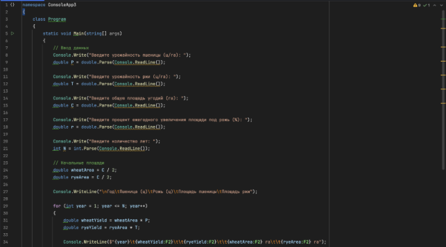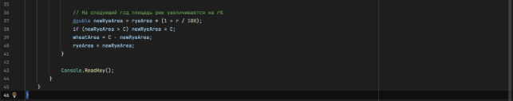

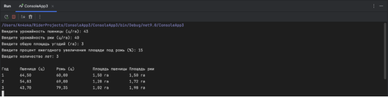

**Практическая работа №2**

Для создания диаграмм UML я выбрала тему своей курсовой работы, но чуть расширила её функционал. А для разработки самих диаграмма мной был опробован [plantuml.com](http://plantuml.com) (а именно создание UML при помощи написания кода)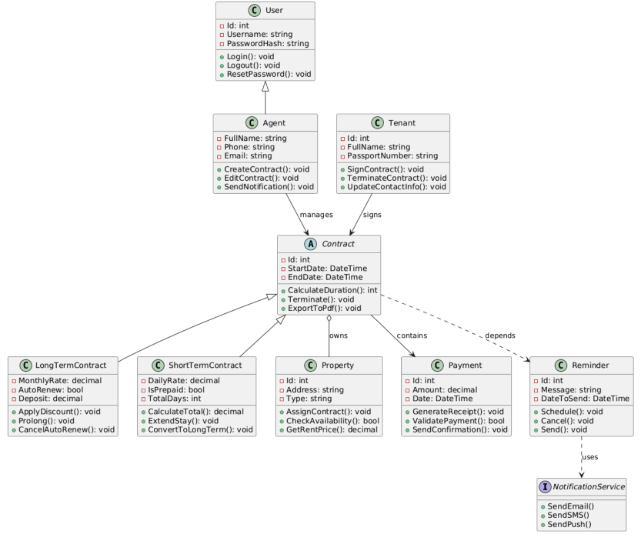

Описание и анализ диаграммы классов информационной системы аренды недвижимости:

Разработанная диаграмма классов отражает ключевые сущности системы аренды, такие как пользователи, агенты, арендаторы, договоры, объекты недвижимости и платежи. Центральным элементом системы является абстрактный класс Contract, от которого наследуются LongTermContract и ShortTermContract, что позволяет реализовать принцип полиморфизма и гибко обрабатывать различные типы аренды.

Пользователи системы представлены через иерархию: базовый класс User и наследующий от него Agent, что соответствует принципу наследования и повторного использования кода. Каждый агент может создавать, редактировать и управлять договорами аренды, которые связаны с объектами недвижимости (Property) и арендаторами (Tenant).

Важную роль в системе играют классы Payment и Reminder, обеспечивающие учёт финансовых операций и напоминаний. Reminder зависит от интерфейса NotificationService, что соответствует принципу инверсии зависимостей и повышает расширяемость системы (можно внедрить email, SMS или push-уведомления).

В диаграмме используются различные типы связей: композиция (Contract → Property), агрегация (Contract → Payment), ассоциация (например, Agent ↔ Contract) и реализация интерфейса (NotificationService). Это демонстрирует грамотное применение принципов ООП: инкапсуляции, наследования, абстракции и полиморфизма.

Данная модель позволяет эффективно расширять и поддерживать систему, реализовывать новые сценарии аренды и взаимодействия с клиентами, при этом сохраняя читаемость и логическую структуру кода.

**Практическая работа №3**

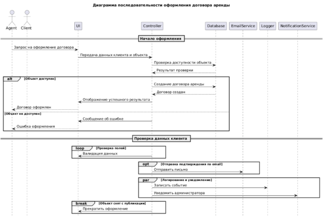

Описание и анализ диаграммы:

Данная диаграмма последовательности моделирует процесс оформления договора аренды в информационной системе. Участвуют два внешних актёра — Agent (арендный агент) и Client (арендатор), а также четыре основные линии жизни: UI, Controller, Database, EmailService.

Процесс начинается с того, что клиент заполняет форму заявки на аренду через пользовательский интерфейс (UI). Затем данные передаются контроллеру, который инициирует проверку заполненных данных. Этот шаг реализован через фрагмент opt (опциональное выполнение) — валидация происходит только при наличии всех обязательных данных.

Затем в фрагменте alt (альтернатива) осуществляется проверка доступности объекта. Если объект уже занят, последовательность прерывается с помощью break, и клиент получает сообщение об ошибке. Если объект свободен - происходит создание договора аренды в базе данных и начинается фрагмент par (параллельное выполнение): договор сохраняется в БД и одновременно отправляется уведомление клиенту на e-mail через EmailService.

Ключевые элементы:

- Синхронные вызовы: UI → Controller, Controller → Database
- Асинхронные вызовы: Controller → EmailService
- Ответные сообщения: EmailService → Controller, Controller → UI
- Фрагменты управления потоком: opt, alt, par, loop, break

**Практическая работа №4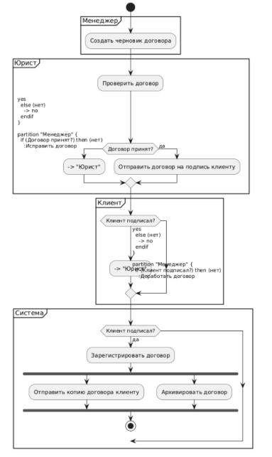**

Описание и анализ диаграммы:

Диаграмма показывает процесс добавления арендатора в систему, начиная с момента инициализации действия пользователем до его успешного завершения или отказа.

В диаграмме представлены следующие элементы:

Участники (дорожки):

- Пользователь (User) — инициирует процесс добавления арендатора.
- Система (Application) — логика интерфейса и бизнес-проверок.
- База данных (Database) — операции записи и поиска.

Основной поток действий:

- Пользователь запускает форму добавления арендатора (начальный узел).
- Система отображает форму (UI).
- Пользователь заполняет данные и нажимает кнопку «Добавить».
- Система выполняет валидацию данных (узел решения). Если данные некорректны — отображается сообщение об ошибке (ветвление через decision и возврат к вводу).
- Система проверяет наличие арендатора в базе (по ФИО и номеру паспорта). Если арендатор уже существует — показывается предупреждение (узел alt) и возможен возврат к вводу или отмена (фрагмент break).
- Если арендатор не найден — данные сохраняются в БД (действие БД).
- Появляется сообщение об успешном добавлении.
- Система возвращает пользователя на главное меню или предлагает продолжить.

**Практическая работа №5 « Консольный проводник файловой системы»** 

**Практическая работа №6 «Приложение для работы с дисками»**

**Практическая работа №7 «Модификация консольного проводника с возможностью создания файлов»**

Мной было приятно решение сразу объединить данные три практические работы в один проект, но для большей разборчивости кода написать каждую в отдельном классе

1 класс - для проводника файловой системы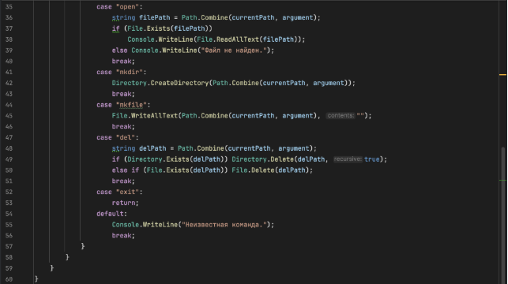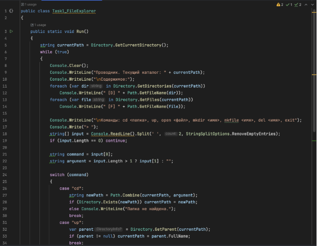

2 класс - для управления диском

3 класс - для модиф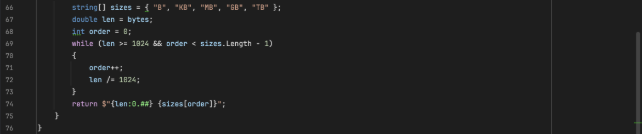икации проводника

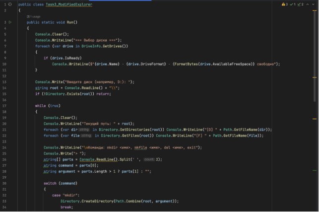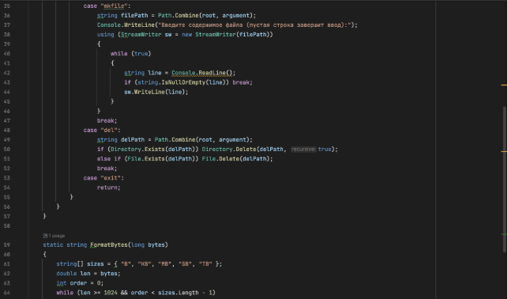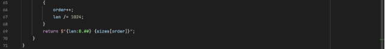

Все данные три класса объединяются в Program.cs

В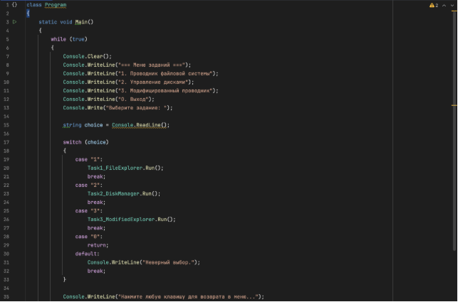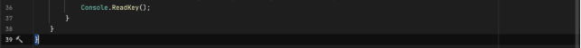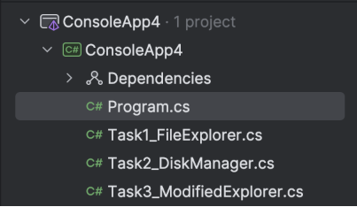от сама структура классов в проекте

Результат:

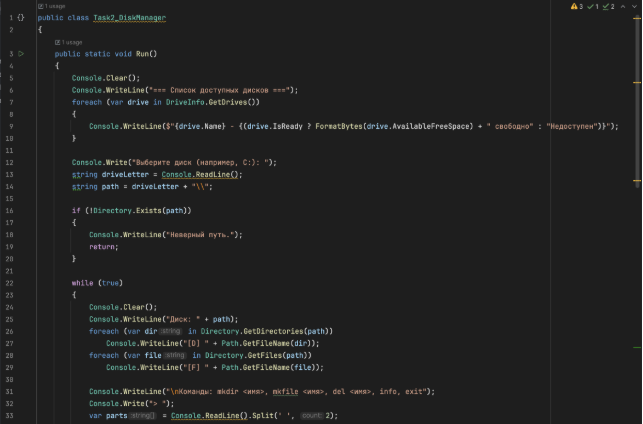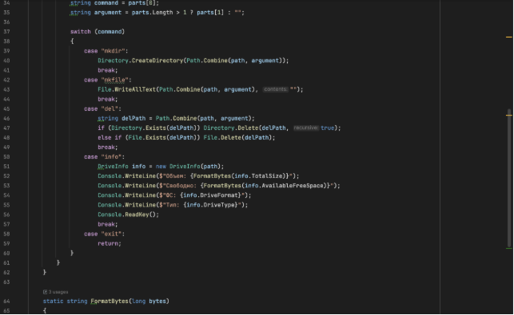

При выборе 1 открывается проводник: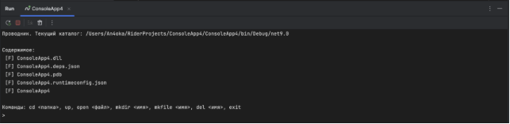

При выборе 2 открывает управление дисками: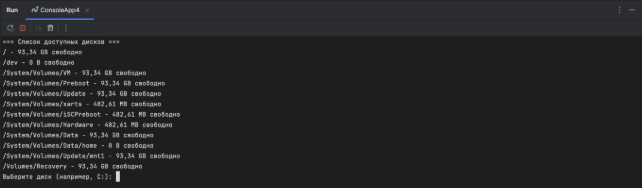

При вы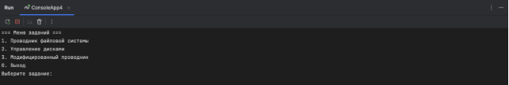боре 3 открывается проводник, но с модификациями (но для начала надо выбрать диск) :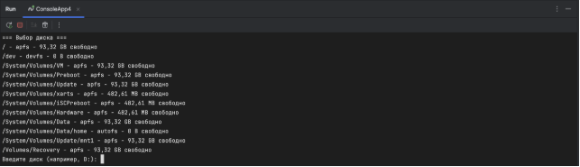

При выборе 0 проект останавливается: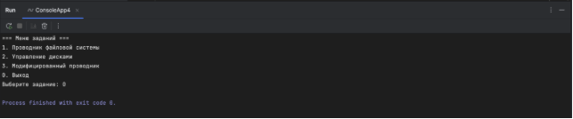

